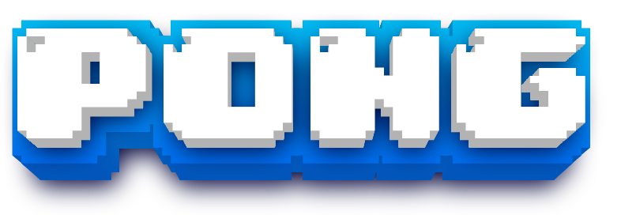
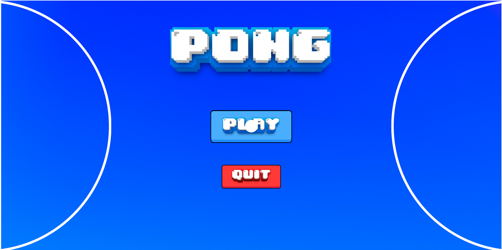
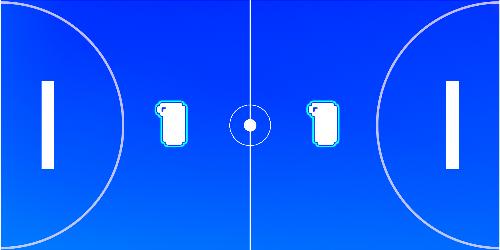

# 🕹️ Pong Game - Web Multiplayer (PC)



A modern twist on the classic **Pong** game, rebuilt for the **web and PC** using **Unity**. Challenge your friends in real-time matches with fluid gameplay, clean visuals, and keyboard controls.

---

## 🚀 Features

- 🔄 Real-time multiplayer Pong experience
- 🌐 WebGL and PC build ready
- 🎮 Smooth paddle and ball physics
- 💥 Dynamic bounce logic with speed ramping
- 🎨 Pixel-art inspired visuals
- 📊 Score tracking with UI feedback

---

## 📸 Screenshots

| Start Menu | Gameplay |
|------------|----------|
|  |  |

---

## 🧩 Tech Stack

- **Unity** (2022.3 or later)
- **Unity WebGL Build Support**
- **DOTween** (for smooth bounce effects)
- **TextMeshPro** for UI

---

## 🛠️ How to Run

1. Clone this repository:
   ```bash
   git clone https://github.com/yourusername/PongWebGame.git
   ```

2. Open the project in Unity Hub (2022.3+ recommended)

3. Make sure the following packages are installed:
   - `DOTween`
   - `TextMeshPro` (included by default)
   - (Optional) `Unity Relay` for online features

4. Choose your platform:
   - For Web: Build with **WebGL**
   - For PC: Build with **Windows/Mac/Linux**

---

## 📁 Folder Structure

```
Assets/
├── Scripts/
│   ├── BallScript.cs
│   ├── PaddleController.cs
│   ├── GameManager.cs
│   └── ...
├── Sprites/
│   ├── Ball.png
│   ├── Paddle.png
│   └── ...
├── Scenes/
│   ├── MainMenu.unity
│   └── Game.unity
├── UI/
└── DOTween/
```

---

## ✨ Future Improvements

- 🌍 Online matchmaking
- 🎵 Retro sound effects and background music
- 🥇 High score tracking
- 📱 Mobile control support

---

## 👨‍💻 Author

**Safeer Ahmad Rana**  
📧 safeerrana54@gmail.com  
🌐 [LinkedIn](https://www.linkedin.com/in/safeer-ahmed-rana/)

---

## ⭐ Star this repo if you enjoyed playing it!
